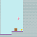
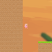
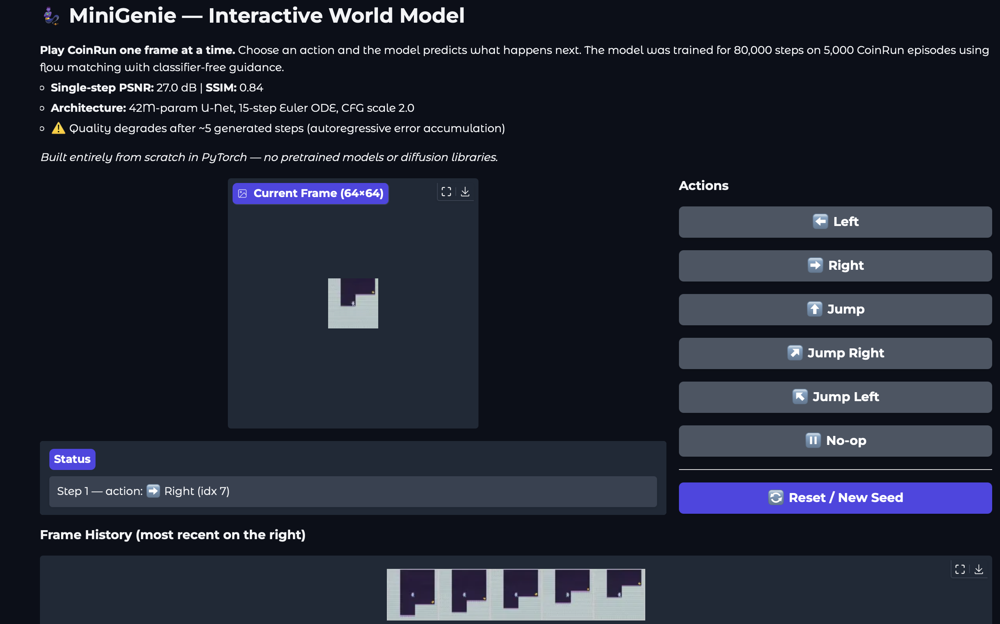

# MiniGenie 🧞

> A video world model that learns to imagine game frames — built entirely from scratch in PyTorch.


<p align="center">
  &nbsp;&nbsp;&nbsp;&nbsp;
  
</p>
<p align="center">
  <em>Autoregressive rollouts generated entirely by MiniGenie. Given 4 real context frames and a sequence of actions, the model imagines what happens next — one frame at a time.</em>
</p>

---

## What is this?

MiniGenie is a **flow matching video world model** that predicts the next frame of a game given past frames and a player action. Feed it 4 context frames and an action (e.g., "move right"), and it generates what the next frame should look like — learning the physics, dynamics, and visual style of the game purely from observation.

**Built entirely from scratch.** No pretrained models, no diffusion libraries, no external frameworks beyond PyTorch. Every component — VQ-VAE tokenizer, flow matching U-Net, training loops, evaluation pipeline — is implemented from first principles.

---

## Results

Trained on **CoinRun** (5,000 episodes, 80K steps):

| Metric | Value | Target |
|--------|-------|--------|
| Single-step PSNR | **26.75 dB** | ≥ 22 dB ✅ |
| Single-step SSIM | **0.840** | — |
| VQ-VAE PSNR | **31.12 dB** | ≥ 28 dB ✅ |
| Codebook utilization | **100%** | ≥ 80% ✅ |

### Rollout quality over time

The plot below shows how prediction quality degrades as the model generates frames autoregressively (each predicted frame becomes input for the next). Quality is strong for the first few steps, then drops as errors accumulate — the classic compounding-error problem in autoregressive generation.

<p align="center">
  
</p>
<p align="center">
  <em>PSNR (blue) and SSIM (green) over 50 rollout steps, averaged across 200 rollouts. The red dashed line marks the 22 dB target. The model produces recognizable frames for ~3–5 steps before quality degrades significantly.</em>
</p>

### Honest limitations
- **Rollout quality:** Degrades after ~5 autoregressive steps (PSNR drops from 27 → 14 dB by step 10). Each prediction is slightly imperfect, and those errors compound when fed back as context.
- **Action conditioning:** Weak (L2 distance 0.064 between different-action predictions). The model predicts plausible next frames but doesn't strongly differentiate between actions at 80K training steps (53% of planned budget).

Full evaluation with plots and analysis: [docs/EVALUATION.md](docs/EVALUATION.md)

---

## Architecture

```
Context frames (4×3 channels) ──┐
                                 ├─ concat ─→ U-Net ─→ predicted velocity ─→ ODE integrate ─→ next frame
Noisy target (3 channels) ──────┘              ↑
                                          action + time
                                        (AdaGN conditioning)
```

| Component | Details |
|-----------|---------|
| **Dynamics model** | 42M-param pixel-space flow matching U-Net |
| **Conditioning** | Adaptive Group Normalization (AdaGN) — injects action + flow time into every ResBlock |
| **Generation** | 15-step Euler ODE integration with classifier-free guidance (scale 2.0) |
| **Training** | Flow matching loss + noise augmentation (GameNGen technique) + 10% CFG dropout |
| **VQ-VAE** | Standalone tokenizer — 512-entry codebook, EMA updates, L2 normalization |

*Full architecture spec: [docs/build_spec.md](docs/build_spec.md)*
*Mathematical foundations: [docs/foundations_guide.md](docs/foundations_guide.md)*

---

## Game

🪙 **CoinRun** — A procedurally generated platformer from [Procgen](https://openai.com/research/procgen-benchmark). The agent navigates randomized terrain, avoids enemies, and collects a coin. Every level has a different layout and visual theme — making it a challenging test for a generative model.

---

## Interactive Demo

<p align="center">
  
</p>
<p align="center">
  <em>The Gradio demo lets you step through CoinRun one frame at a time. Pick an action, and the model imagines the next frame.</em>
</p>

```bash
# On Colab (GPU) or local (CPU, slower)
python -m src.demo.app \
    --ckpt-dir checkpoints/dynamics \
    --data-dir data/coinrun/episodes \
    --share  # creates a public Gradio link
```

---

## Setup

```bash
# Clone
git clone https://github.com/BrutalCaeser/minigenie.git
cd minigenie

# Create virtual environment
python3 -m venv .venv
source .venv/bin/activate

# Install dependencies
pip install --upgrade pip
pip install -r requirements.txt
pip install -e .

# Run tests (144 should pass)
python -m pytest tests/ -v
```

## Training

Training requires a GPU (Google Colab recommended). See the Colab notebooks:

1. **[01_train_vqvae.ipynb](notebooks/01_train_vqvae.ipynb)** — Train the VQ-VAE tokenizer (50K steps, ~2 hours on T4)
2. **[02_train_dynamics.ipynb](notebooks/02_train_dynamics.ipynb)** — Train the dynamics model (80K steps, ~8 hours on A100)
3. **[03_evaluate.ipynb](notebooks/03_evaluate.ipynb)** — Run full evaluation suite

### Data generation
CoinRun episodes are generated on Colab using `procgen2`:
```bash
pip install procgen2
python -m src.data.generate_procgen --game coinrun --episodes 5000 --save-dir data/coinrun
```

---

## Project Structure

```
src/
├── models/
│   ├── blocks.py          # ResBlock, AdaGN, SelfAttention, SinusoidalEmbed
│   ├── unet.py            # Flow matching U-Net (42M params)
│   └── vqvae.py           # VQ-VAE tokenizer (6.1M params)
├── training/
│   ├── train_vqvae.py     # VQ-VAE training loop
│   ├── train_dynamics.py  # Flow matching training loop
│   └── checkpoint.py      # CheckpointManager (save/load/resume)
├── data/
│   ├── generate_procgen.py  # Data collection from Procgen
│   └── dataset.py         # PyTorch Dataset
├── eval/
│   ├── rollout.py         # Autoregressive generation
│   ├── metrics.py         # PSNR, SSIM, action differentiation
│   └── visualize.py       # Rollout grids, plots, GIFs
└── demo/
    └── app.py             # Gradio interactive demo
```

## Documentation

- [docs/build_spec.md](docs/build_spec.md) — Architecture specification and hyperparameters
- [docs/foundations_guide.md](docs/foundations_guide.md) — Mathematical foundations (VQ-VAE, flow matching)
- [docs/EVALUATION.md](docs/EVALUATION.md) — Full evaluation report with honest failure analysis
- [logs/BUILD_LOG.md](logs/BUILD_LOG.md) — Development diary
- [logs/TRAINING_LOG.md](logs/TRAINING_LOG.md) — Per-session training records

## References

Draws ideas from:
- VQ-VAE (van den Oord et al., 2017)
- Flow Matching (Lipman et al., 2023)
- DIAMOND (Alonso et al., 2024) — conditioning design
- GameNGen (Valevski et al., 2024) — noise augmentation

The architecture and analysis are original. Not a reimplementation of any specific paper.

## License

MIT
