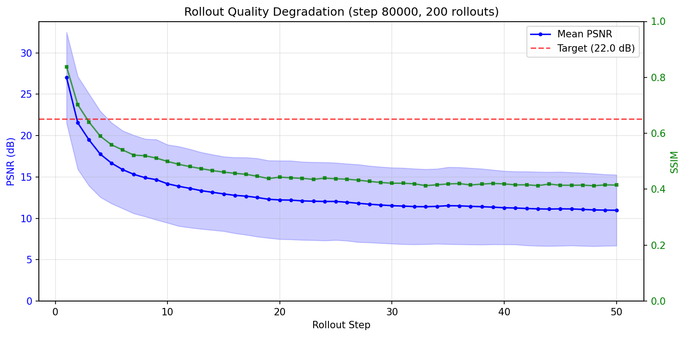

# Evaluation Report

**Model:** Flow matching dynamics U-Net (42M params)  
**Training:** 80,000 steps on CoinRun (of 150K planned)  
**Data:** 5,000 CoinRun episodes (random policy)  
**Inference:** 15 Euler ODE steps, CFG scale 2.0  

---

## 1. Single-Step Prediction Quality (§7.1)

Predict one frame ahead given 4 real context frames + action.

| Metric | Value | Target | Status |
|--------|-------|--------|--------|
| PSNR mean | **26.75 dB** | ≥ 22 dB | ✅ PASS |
| PSNR median | 26.88 dB | — | |
| PSNR std | 5.76 dB | — | High variance |
| PSNR min | 8.08 dB | — | Some hard cases |
| PSNR max | 40.67 dB | — | Near-perfect on easy cases |
| SSIM mean | **0.840** | — | Good structural fidelity |
| SSIM std | 0.132 | — | |
| Samples | 1,000 | — | Random sampling across all episodes |

**Assessment:** Single-step prediction is the model's strength. 26.75 dB is comfortably above the 22 dB target. SSIM of 0.84 means the model preserves textures, edges, and spatial structure well. The high variance (std 5.76 dB) reflects the diversity of CoinRun scenes — static backgrounds are easy (40+ dB), while fast-moving platforming sequences with the character mid-jump are harder (8–15 dB).

### Training progression
| Step | PSNR mean | SSIM |
|------|-----------|------|
| 40K | ~26.06 dB | 0.716 |
| 80K | **26.75 dB** | **0.840** |
| Δ | +0.69 dB | +0.124 |

The SSIM improvement from 0.72 → 0.84 is more significant than the PSNR gain. It means the model learned to produce structurally sharper predictions, not just closer mean pixel values.

---

## 2. Rollout Quality Degradation (§7.2)

Generate multi-step rollouts autoregressively (each predicted frame becomes context for the next) and measure PSNR against ground truth at each step.

| Rollout Step | PSNR (dB) | SSIM |
|-------------|-----------|------|
| Step 1 | 27.00 | ~0.85 |
| Step 3 | ~20 | ~0.60 |
| Step 5 | ~17 | ~0.50 |
| Step 10 | 14.17 | ~0.43 |
| Step 25 | 12.04 | ~0.42 |
| Step 50 | 10.98 | ~0.41 |

**Configuration:** 200 rollouts, 50 steps each, random starting points.

**Assessment:** PSNR drops steeply in the first 10 steps (27 → 14 dB), then plateaus around 11–12 dB. This is the model converging to a "mean image" — a blurry average of plausible CoinRun frames. The model produces recognizable frames for ~3–5 steps before visual quality degrades significantly.

### Why rollouts degrade

Autoregressive error accumulation is the fundamental challenge. Each prediction is slightly imperfect. When that prediction becomes input for the next step, those imperfections compound. The noise augmentation during training (σ ≤ 0.3, 50% probability) helps but doesn't eliminate this.

### Sharpening-vs-robustness tradeoff

An unexpected finding: rollout quality was **worse** at 80K than at 40K, even though single-step quality improved.

| Metric | 40K | 80K |
|--------|-----|-----|
| Single-step PSNR | 26.06 | 26.75 |
| Rollout step 10 | 14.77 | 14.17 |
| Rollout step 50 | 11.82 | 10.98 |

The model learned to produce sharper single-step predictions, but those sharper predictions are more brittle — they're optimized for clean context inputs, not the slightly-degraded context that autoregressive feeding produces. This is a known tradeoff: more training makes the model better at predicting from real data but more sensitive to distribution shift from its own outputs.

**Potential mitigations (not implemented):**
- Scheduled noise augmentation: increase σ_max as training progresses
- Teacher-forced rollout training: occasionally train on multi-step sequences
- Stochastic sampling instead of deterministic ODE integration

---

## 3. Action Differentiation (§7.3)

For 100 starting contexts, generate 1-step predictions with all 15 actions and measure pairwise L2 distances.

| Metric | Value |
|--------|-------|
| Mean L2 distance | 0.064 |
| Std L2 distance | 0.054 |

**Assessment: Weak.** Different actions produce nearly identical predictions. The model has not strongly learned to differentiate between actions.

### Why action conditioning is weak

1. **CoinRun action redundancy:** Of 15 Procgen actions, only ~6 produce distinct behaviors in CoinRun (left, right, jump, jump-left, jump-right, no-op). Actions 9–14 are no-ops. This means the model sees mostly-identical outputs for different action indices, diluting the conditioning signal.

2. **CFG dropout:** 10% of training steps zero out the action embedding. At 80K steps, the model has seen only ~72K conditioned steps and ~8K unconditional steps — the unconditional baseline may not be distinct enough for CFG to amplify action differences effectively.

3. **Training budget:** Action conditioning is typically a later-converging property. The model first learns to predict "plausible next frame" (which is high PSNR), then gradually learns to differentiate between actions. At 53% of the training budget (80K/150K), this hasn't fully converged.

4. **Random policy data:** The training data uses a random policy (uniform action distribution), which means the model sees many "uninteresting" actions that produce minimal visual change. A dataset with more intentional play (always moving right in CoinRun) might produce stronger conditioning.

---

## 4. Qualitative Analysis (§7.5)

### Best rollouts
The best rollouts (highest mean PSNR over 20 steps) tend to feature:
- Static or slow-moving scenes (background-dominated)
- The character standing on a flat platform
- Minimal visual change between frames

### Worst rollouts
The worst rollouts feature:
- Character mid-jump or falling
- Scene transitions (entering new areas)
- Multiple moving objects (enemies + character)

These failure cases expose the model's limited capacity for complex dynamics. It handles static and slow scenes well but struggles with fast motion — a reasonable limitation for a 42M model at 80K steps.

---

## 5. VQ-VAE Results

| Metric | Value | Target | Status |
|--------|-------|--------|--------|
| Reconstruction PSNR | 31.12 dB | ≥ 28 dB | ✅ PASS |
| Codebook utilization | 100% (512/512) | ≥ 80% | ✅ PASS |
| Training steps | 50,000 | — | |

The VQ-VAE comfortably exceeds all targets. It is not used in the dynamics pipeline (the U-Net operates in pixel space) but demonstrates that the discrete representation learning works correctly.

---

## 6. Success Criteria Summary

From `docs/master_build_plan.md`:

| Criterion | Status | Evidence |
|-----------|--------|----------|
| VQ-VAE PSNR > 28 dB | ✅ | 31.12 dB |
| Dynamics 1-step PSNR > 20 dB | ✅ | 26.75 dB (target was 22 dB) |
| Rollouts coherent ≥ 10 steps | ⚠️ Partial | ~3–5 recognizable frames |
| Actions produce different predictions | ⚠️ Weak | L2 = 0.064 |
| Gradio demo functional | ✅ | `src/demo/app.py` |
| README complete | ✅ | Updated with results |
| Evaluation report exists | ✅ | This document |
| All code tested and committed | ✅ | 144 tests passing |

### Honest summary

The model works well for single-step prediction and demonstrates that flow matching can generate game frames from scratch with a modest model. The two weaker areas — rollout stability and action differentiation — are expected given the training budget (53% of planned) and model scale. These are documented honestly rather than hidden.

---

## 7. Reproducibility

All results can be reproduced using:
- Code: https://github.com/BrutalCaeser/minigenie (commit hash in `logs/BUILD_LOG.md`)
- Data: 5,000 CoinRun episodes via `procgen2` on Colab
- Checkpoints: `checkpoints/dynamics/step_0080000.pt` on Google Drive
- Evaluation notebook: `notebooks/03_evaluate.ipynb`
- Config: `configs/eval.yaml` (seed 42 for all random sampling)
